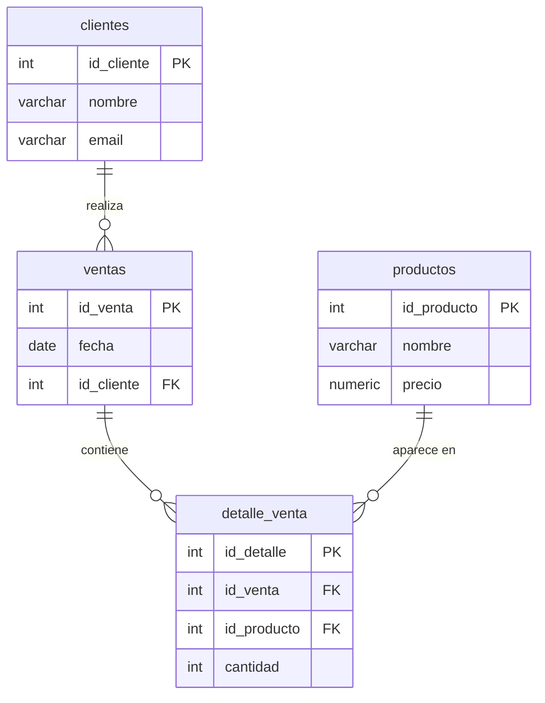

# 🧩 SQL Sistema de Ventas

Sistema de base de datos relacional para una tienda de tecnología, desarrollado con PostgreSQL.

---

## 1. Descripción del proyecto

Este sistema modela las operaciones básicas de una tienda de tecnología. Permite registrar clientes, productos disponibles, ventas realizadas y el detalle de productos incluidos en cada venta.

Resuelve preguntas de negocio como:
- ¿Qué clientes compran más?
- ¿Qué productos se venden más?
- ¿Qué ventas incluyen más de un producto?

---

## 2. Tecnologías utilizadas

- PostgreSQL
- SQL estándar (SELECT, WHERE, ORDER BY, JOIN, GROUP BY, HAVING, COUNT, SUM, AVG)

---

## 3. Instrucciones de uso

### Requisitos previos
- Tener PostgreSQL instalado y corriendo
- Tener acceso a `psql` o a un cliente como DBeaver / TablePlus

### Paso 1 — Crear la estructura de tablas

```bash
psql -U tu_usuario -d tu_base_de_datos -f schema.sql
```

### Paso 2 — Cargar los datos de prueba

```bash
psql -U tu_usuario -d tu_base_de_datos -f seed.sql
```

### Paso 3 — Ejecutar las consultas del reporte

```bash
psql -U tu_usuario -d tu_base_de_datos -f report.sql
```

> Reemplaza `tu_usuario` y `tu_base_de_datos` con tus credenciales reales.

---

## 4. Diagrama ER



---

## 5. Estructura del repositorio

```
sql-sistema-ventas/
│
├── schema.sql     ← Crea las tablas
├── seed.sql       ← Inserta datos de prueba
├── report.sql     ← Consultas del reporte (26 preguntas + bonus)
└── README.md      ← Este archivo
```